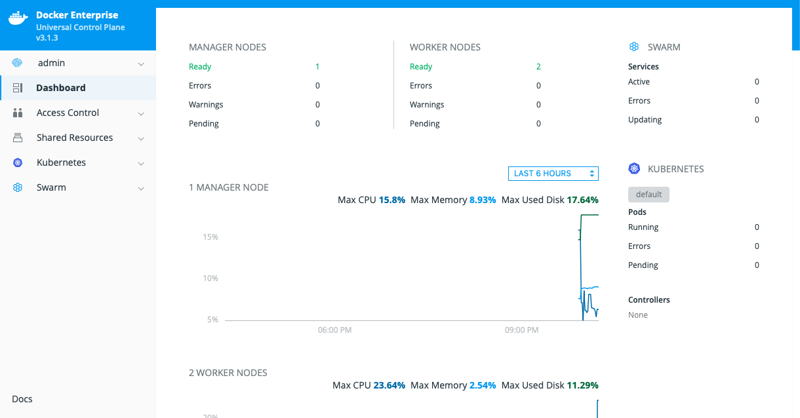
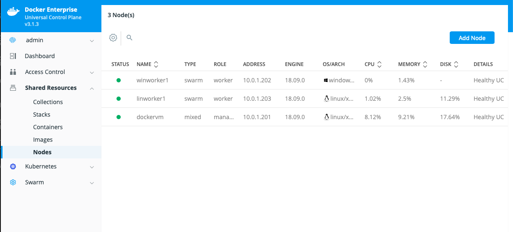
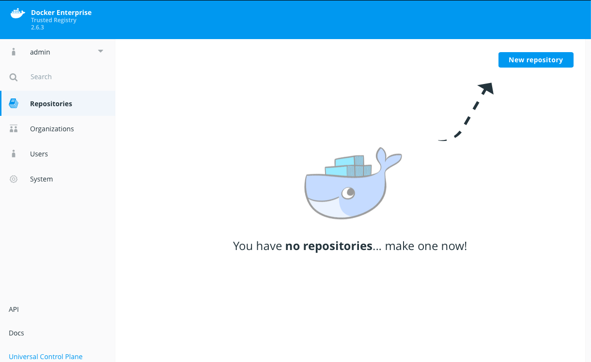

# Build Docker Enterprise 2.1 cluster on Alibaba Cloud using Terraform

## Overview

Files included in this repository will help you build a 3-node Docker Enterprise cluster

1. One Linux server that hosts both Docker UCP and Docker Trusted Registry (DTR). Same node will also be configured as the Swarm Manager and Kubernetes Master.
2. One Linux host which will be automatically joined as a worker node, in the Docker Swarm created by the UCP host
3. One Windows host which will be automatically joined as a worker node, in the Docker Swarm created by the UCP host

## Pre-requisites to deploy this infrastructure

1. Alibaba Cloud account with access to create resources (free account will not work)
2. Docker Enterprise licence - you can get a free trial licence from [Docker Store](https://hub.docker.com/editions/enterprise/docker-ee-trial) which is valid for 30 days
3. Terraform v0.11, which you can download free from [HashiCorp site](https://www.terraform.io/downloads.html)

**The templates and scripts provided will perform a fully automated deployment of the Docker Enterprise cluster. In-depth knowledge of Terraform or scripting is not required to perform the steps**

**Steps given in the next section are to be performed from your Laptop running MacOS or Linux. If it is a Windows Laptop, please install [GitBash](https://gitforwindows.org/)**

## Steps to deploy the Docker Enterprise cluster on Alicloud (Alibaba Cloud)

1. Clone this git repository to your Laptop
2. Goto the folder where the files are saved
3. Update 5 values in `terraform.tfvars` using the information from the following steps
    - Get the Alicloud access keys
      - Login to Alibaba cloud console
      - Select Access Keys from the Account menu, which is at the top right hand corner
      - Note down / copy the Access Key ID and Access Key Secret
    - Run `curl -s ifconfig.me` or goto [https://www.whatismyip.com](https://www.whatismyip.com) to note your public IP. This is the value for `MY_PUBLIC_IP`
    - Go to Docker Store and copy the License URL. This is the value for `DOCKER_EE_URL`
    - Generate the SSH key pair files using `ssh-keygen -m PEM -f docker-alicloud`. Note/copy contents of `docker-alicloud.pub` file. This is the value for `PUBLIC_KEY`

4. Download Docker licence key file - `docker_subscription.lic` - from Docker store and copy the file to `lin-files` folder. Existing empty `docker_subscription.lic` file can be replaced with your copy.

5. Check `terraform` that you downloaded is in your PATH and that you have the latest version.
    - execute `terraform version`. It should show `Terraform v0.11.11` or latest.

6. Execute the following Terraform commands to build the Docker cluster defined in the `.tf` files
   - Run `terraform init` - this will initialize Terraform and download the required plugins
     - you should get an output similar to below
        >* provider.alicloud: version = "~> 1.33"

        >* provider.template: version = "~> 2.1"
    
   - Run `terraform plan` to confirm there are no errors
     - you should get an output similar to below. (Output truncated for brevity)
        > Plan: 14 to add, 0 to change, 0 to destroy.
    
    - Run `terraform apply` to build the infrastructure. It will take approximately 30 minutes to complete.
      - If the build is successful, you should get an output similar to below. Note down this information as you will need this to access the environment.
        > Apply complete! Resources: 14 added, 0 changed, 0 destroyed.

        > Outputs:
            > Docker DTR url = https://8.208.10.56/

            > Docker UCP host ip_address = 8.208.10.56
            
            > Docker UCP url = https://8.208.10.56:8070/
            
            > Linux worker ip_address = 8.208.13.142
            
            > Windows worker ip_address = 8.208.10.237

## Accessing the Docker Enterprise cluster from your Laptop

1. To access the Docker UCP using a browser, go to the `Docker UCP url` shown in Terraform output above
   - Ignore the certificate related warning
   - Login using the Docker admin credentials you mentioned in the `terraform.tfvars` file
   - you should see 1 Swarm manager and 2 worker nodes in Ready status, similar to the screenshot below
    

2. Select `Shared Resources` > `Nodes` to see all nodes in the cluster, similar to the screenshot below
   

3. To access the Docker Trusted Registry (DTR), go to the `Docker DTR url` shown in Terraform output above. You should see DTR similar to the screenshot below
   
    - DTR is also installed on the same host as UCP
    - Once you login to DTR, turn on the setting `Create repository on push` by accessing `System > General > Repositories`. This will ensure repository is automatically created when you run `docker push`

4. To use Docker and Kubernetes CLI, download the client bundle
    - run the `client/download_client_bundle.sh` script
    - give admin credentials, UCP FQDN and port numbers when prompted
      - UCP FQDN is the `Docker UCP host ip_address` shown in the terraform output above. Port number is in the `Docker UCP url`

    - `source env.sh`
    - `docker node ls` - will show all 3 servers (1 manager, 2 worker nodes)
    - `kubectl get nodes` - will show 2 servers (excluding the Windows worker node which do not support Kubernetes)

5. Deploy the `visualizer` app to confirm you are able to deploy containers/applications on to your cluster
    - go to the `client` folder where you have the `visualizer.yml` file
    - deploy the application using `docker stack`
        > HTTP_PORT=8083 docker stack deploy -c visualizer.yml visualizer

    - visit http://<Docker UCP host ip_address>:8083 to see the application running. Visualizer app will show the contianers running on all nodes. *It may take few minutes for this to show first time.*